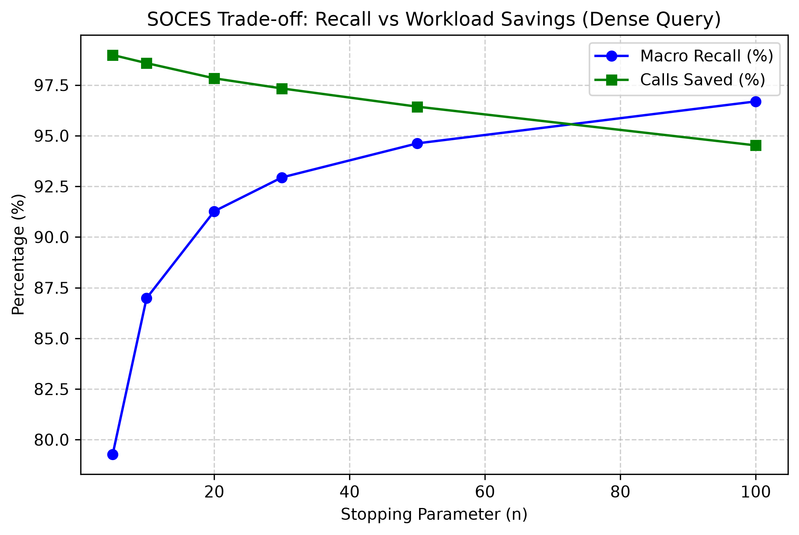

# SOCES Dense Query Validation

This directory contains the results of a complete live re-evaluation of the SOCES pipeline, utilizing the new `dense_vector_query` embeddings without abstract truncation limits.

## 1. Trade-off Metrics

**Table 1.** SOCES stopping parameter sweep (*P* ≥ .50, dense query embeddings, dynamic consecutive-exclude).

| *n*              | Macro recall^a^   | Micro recall   | Micro precision   |   Model calls | Calls saved (%)^c^   | Early stopped^b^   |
|:-----------------|:------------------|:---------------|:------------------|--------------:|:---------------------|:-------------------|
| 5                | 79.28%            | 79.90%         | 24.04%            |        10,716 | 98.98%               | 66 / 66            |
| 10               | 86.98%            | 88.35%         | 22.89%            |        14,932 | 98.58%               | 66 / 66            |
| 20               | 91.27%            | 92.75%         | 20.99%            |        22,802 | 97.83%               | 66 / 66            |
| 30               | 92.94%            | 94.52%         | 20.53%            |        28,132 | 97.33%               | 66 / 66            |
| 50               | 94.62%            | 95.96%         | 19.92%            |        37,574 | 96.43%               | 66 / 66            |
| 100 (optimal)^d^ | 96.69%            | 97.48%         | 19.30%            |        57,741 | 94.52%               | 66 / 66            |
| ∞                | 96.69%            | 97.48%         | 19.30%            |     1,053,162 | 0.00%                | -                  |

^a^ Evaluated on dense vector queries. ^b^ Number of systematic reviews where the consecutive-exclude threshold triggered early termination. ^c^ Projected savings assuming an unstopped real-world baseline corpus of 15,957 documents per systematic review. ^d^ Optimal operating point.

## 2. Top 10 Highest Cut-off (n=100, optimal)

|   SR PMID |   GT |   TP |   FP |   FN | Recall (%)   |   Total Screened |   SOCES Cut-off |
|----------:|-----:|-----:|-----:|-----:|:-------------|-----------------:|----------------:|
|  31585960 |  225 |  224 |  831 |    1 | 99.56%       |             2618 |            2618 |
|  27548070 |   26 |   26 |  181 |    0 | 100.00%      |             2382 |            2382 |
|  24157497 |   61 |   61 |  536 |    0 | 100.00%      |             2273 |            2273 |
|  26903336 |   89 |   89 |  278 |    0 | 100.00%      |             2137 |            2137 |
|  26868137 |   31 |   29 |  458 |    2 | 93.55%       |             2050 |            2050 |
|  32909814 |    9 |    9 |  231 |    0 | 100.00%      |             1950 |            1950 |
|  30326495 |  157 |  156 |  407 |    1 | 99.36%       |             1905 |            1905 |
|  31200992 |   95 |   89 |  384 |    6 | 93.68%       |             1873 |            1873 |
|  27893131 |   45 |   38 |  225 |    7 | 84.44%       |             1850 |            1850 |
|  28114600 |   66 |   65 |  250 |    1 | 98.48%       |             1756 |            1756 |

## 3. Detailed Per-SR Performance (n=100, optimal)

| SR PMID   |   GT |   TP |   FP |   FN | Recall (%)   |   Total Screened | SOCES Cut-off   |
|:----------|-----:|-----:|-----:|-----:|:-------------|-----------------:|:----------------|
| 22226047  |   49 |   48 |  163 |    1 | 97.96%       |              691 | 691             |
| 22323502  |    5 |    5 |   27 |    0 | 100.00%      |              149 | 149             |
| 22422870  |    4 |    4 |   15 |    0 | 100.00%      |              171 | 171             |
| 22777524  |   37 |   36 |  199 |    1 | 97.30%       |              642 | 642             |
| 22872710  |    8 |    8 |   19 |    0 | 100.00%      |              194 | 194             |
| 22986378  |   40 |   40 |  200 |    0 | 100.00%      |             1121 | 1121            |
| 23033409  |   16 |   11 |   19 |    5 | 68.75%       |              192 | 192             |
| 23420235  |   27 |   27 |  157 |    0 | 100.00%      |              534 | 534             |
| 23460092  |   20 |   20 |  126 |    0 | 100.00%      |              922 | 922             |
| 23529983  |    8 |    8 |   39 |    0 | 100.00%      |              232 | 232             |
| 23814120  |   26 |   20 |   37 |    6 | 76.92%       |              348 | 348             |
| 23900314  |    6 |    5 |   51 |    1 | 83.33%       |             1041 | 1041            |
| 23935058  |    5 |    4 |   22 |    1 | 80.00%       |              234 | 234             |
| 24046285  |   12 |   11 |   23 |    1 | 91.67%       |              271 | 271             |
| 24157497  |   61 |   61 |  536 |    0 | 100.00%      |             2273 | 2273            |
| 24592495  |   16 |   16 |   58 |    0 | 100.00%      |              207 | 207             |
| 24727842  |   69 |   62 |  165 |    7 | 89.86%       |              651 | 651             |
| 24922745  |   16 |   16 |  157 |    0 | 100.00%      |              646 | 646             |
| 25006006  |   25 |   24 |   59 |    1 | 96.00%       |              235 | 235             |
| 25059938  |   21 |   21 |   69 |    0 | 100.00%      |              268 | 268             |
| 25556126  |    9 |    9 |   16 |    0 | 100.00%      |              282 | 282             |
| 25569206  |   49 |   48 |  282 |    1 | 97.96%       |             1714 | 1714            |
| 25770113  |    7 |    7 |   18 |    0 | 100.00%      |              342 | 342             |
| 26109551  |   14 |   14 |  127 |    0 | 100.00%      |              785 | 785             |
| 26199070  |   20 |   18 |   41 |    2 | 90.00%       |              307 | 307             |
| 26349907  |    4 |    4 |   31 |    0 | 100.00%      |              140 | 140             |
| 26420387  |    2 |    2 |  227 |    0 | 100.00%      |              978 | 978             |
| 26420598  |   57 |   56 |  158 |    1 | 98.25%       |              725 | 725             |
| 26830055  |   29 |   29 |  247 |    0 | 100.00%      |              790 | 790             |
| 26830221  |   75 |   75 |  192 |    0 | 100.00%      |             1010 | 1010            |
| 26868137  |   31 |   29 |  458 |    2 | 93.55%       |             2050 | 2050            |
| 26903336  |   89 |   89 |  278 |    0 | 100.00%      |             2137 | 2137            |
| 27142267  |   10 |   10 |   31 |    0 | 100.00%      |              552 | 552             |
| 27548070  |   26 |   26 |  181 |    0 | 100.00%      |             2382 | 2382            |
| 27737830  |   75 |   75 |  291 |    0 | 100.00%      |             1110 | 1110            |
| 27802478  |   77 |   74 |  259 |    3 | 96.10%       |             1232 | 1232            |
| 27802505  |   21 |   21 |   81 |    0 | 100.00%      |              392 | 392             |
| 27893131  |   45 |   38 |  225 |    7 | 84.44%       |             1850 | 1850            |
| 28114600  |   66 |   65 |  250 |    1 | 98.48%       |             1756 | 1756            |
| 28348110* |   24 |   21 | 2602 |    3 | 87.50%       |             3000 | -               |
| 28903922* |   24 |   23 | 2370 |    1 | 95.83%       |             3000 | -               |
| 29049756  |   20 |   19 |   66 |    1 | 95.00%       |              608 | 608             |
| 29187358* |   38 |   34 | 2365 |    4 | 89.47%       |             3000 | -               |
| 29540345  |   13 |   13 |  115 |    0 | 100.00%      |             1532 | 1532            |
| 30158148  |   45 |   42 |   95 |    3 | 93.33%       |              956 | 956             |
| 30326495  |  157 |  156 |  407 |    1 | 99.36%       |             1905 | 1905            |
| 30383109  |   37 |   33 |   76 |    4 | 89.19%       |              688 | 688             |
| 30409774  |   36 |   36 |  105 |    0 | 100.00%      |              491 | 491             |
| 30617123  |   29 |   29 |   95 |    0 | 100.00%      |              254 | 254             |
| 30884526  |   78 |   77 |  359 |    1 | 98.72%       |             1195 | 1195            |
| 30917990  |   90 |   90 |  267 |    0 | 100.00%      |              718 | 718             |
| 31200992  |   95 |   89 |  384 |    6 | 93.68%       |             1873 | 1873            |
| 31255301  |   61 |   61 |  169 |    0 | 100.00%      |              378 | 378             |
| 31585960  |  225 |  224 |  831 |    1 | 99.56%       |             2618 | 2618            |
| 31591158  |   16 |   16 |   65 |    0 | 100.00%      |              329 | 329             |
| 31727627  |  129 |  129 |  235 |    0 | 100.00%      |              640 | 640             |
| 31990319  |   20 |   20 |   71 |    0 | 100.00%      |              593 | 593             |
| 32199484* |   10 |    0 |    6 |   10 | 0.00%        |              147 | 147             |
| 32371466  |   50 |   50 |   90 |    0 | 100.00%      |             1662 | 1662            |
| 32427305  |   13 |   13 |   70 |    0 | 100.00%      |              623 | 623             |
| 32442035  |   15 |   11 |  154 |    4 | 73.33%       |             1687 | 1687            |
| 32459529  |    9 |    9 |   32 |    0 | 100.00%      |              235 | 235             |
| 32479176  |   28 |   28 |  128 |    0 | 100.00%      |              726 | 726             |
| 32496521  |   24 |   24 |  319 |    0 | 100.00%      |             1072 | 1072            |
| 32909814  |    9 |    9 |  231 |    0 | 100.00%      |             1950 | 1950            |
| 33148618  |   66 |   65 |   70 |    1 | 98.48%       |              553 | 553             |
| 33176180  |    4 |    4 |   11 |    0 | 100.00%      |              137 | 137             |
| 33186535  |    6 |    6 |   91 |    0 | 100.00%      |             1397 | 1397            |
| 33441384  |   16 |   16 |   67 |    0 | 100.00%      |              496 | 496             |
| 33472813  |   30 |   30 |   42 |    0 | 100.00%      |              869 | 869             |

*Note: 32199484, 29187358, 28348110, and 28903922 were excluded from aggregate calculations due to erroneous source corpus labeling and missing abstracts.*

## Details
- **Rankings**: `candidate_rankings.parquet` contains all candidates and their cosine similarity to the dense queries.
- **Scores**: `sweep_results_raw.csv` contains all JEV scores up to $n=100$.
